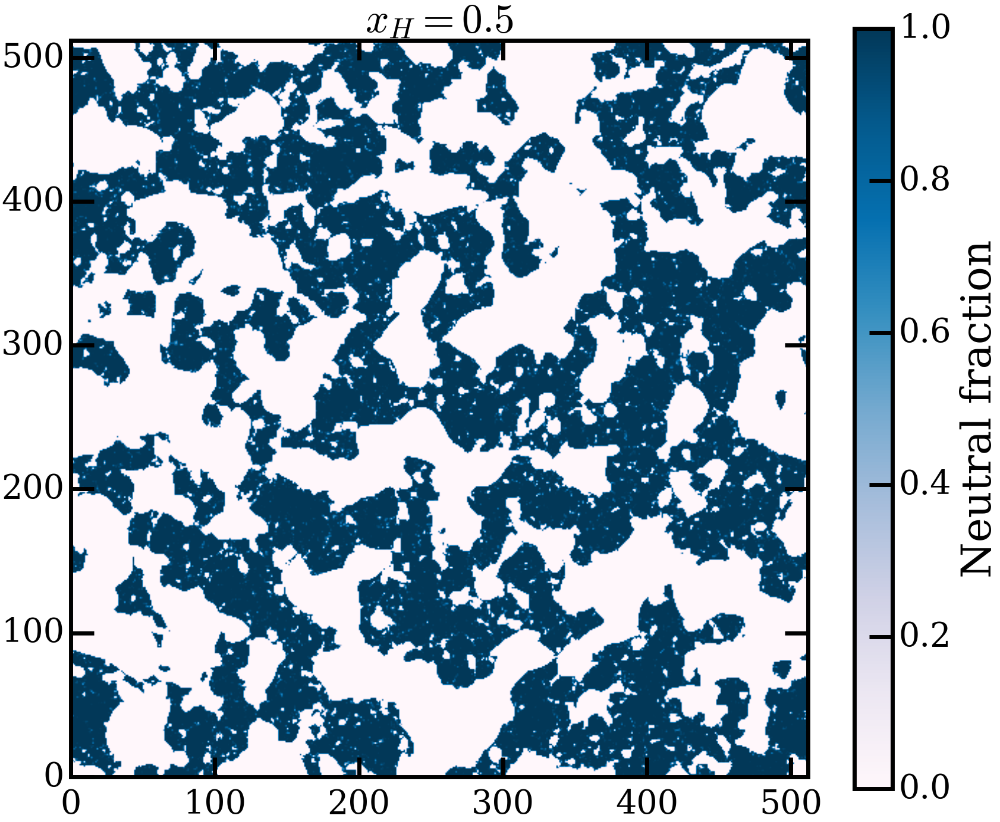

# Damping Wings — Parametric Simulation & Fisher Matrix Inference Pipeline

[](https://www.python.org/)
[](LICENSE)
[](https://doi.org/REPLACE_WITH_DOI)

A general OOP-based Python pipeline for batch parametric semi-numerical simulation and Fisher Information Matrix-based parameter inference. Developed as part of research published in The Astrophysical Journal (2025).

While the reference implementation studies Lyman-alpha damping wing profiles during the Epoch of Reionization, the pipeline is designed to be **modular and observable-agnostic** — the simulation backend and observable class can be replaced for any parametric physical system.

---

## What This Does

During the Epoch of Reionization (z ~ 6–8), the intergalactic medium transitions from neutral to ionized hydrogen. Quasar spectra from this era carry imprints of this process in the form of **Lyman-alpha damping wings** — characteristic absorption features that encode information about the neutral hydrogen fraction and reionization topology.

This pipeline:

1. **Generates ionized simulation boxes** using semi-numerical simulations (via 21cmFAST), parameterised by neutral hydrogen fraction (x_HI), minimum halo mass (M_min), quasar lifetime (t_q), and quasar host mass (M_qso)
2. **Calculates damping wing profiles** along simulated sightlines through the IGM, treating dark matter halos as quasar hosts
3. **Constructs observables** — median damping wing profiles and sightline-to-sightline scatter — from ensembles of simulated quasar spectra
4. **Derives parameter constraints** using Fisher Information Matrix analysis, quantifying how well a given survey can constrain reionization parameters



### Key Result

A sample of **64 quasars at redshift z = 7** can constrain:
- Neutral hydrogen fraction x_HI to **2%**
- Minimum halo mass M_min to **0.53 dex**
- Quasar lifetime t_q to **0.12 dex**
- Quasar host mass M_qso to **0.32 dex**

This constraining power is **comparable to predictions for current 21 cm radio experiments**, achieved from standard optical quasar spectra alone.

---

## Papers

If you use this code, please cite:

- Y. M. Sharma et al., *"Behavior of the Ly-α Damping Wings as a Function of Reionization Topology"*, The Astrophysical Journal, 2025.
- Y. M. Sharma et al., *"Constraining Ly-α Damping Wings Using Fisher Matrix"*, The Astrophysical Journal, 2025.

---

## Pipeline Architecture

The pipeline is built around an OOP-based architecture for efficient batch simulation and analysis:

```
config/parameters_file.py    — fiducial parameter definitions
        ↓
Models(param_ranges)         — constructs parameter grid and rank system
        ↓
ionized_boxes.py             — generates 21cmFAST ionized boxes per rank
        ↓
calculating_skewers.py       — computes sightlines through simulation boxes
        ↓
damping_wings.py             — calculates Ly-α transmission profiles
        ↓
Fisher Matrix Analysis       — parameter constraints (separate repo)
```

**Key modules:**

| Module | Description |
|---|---|
| `modelling_class.py` | `Models` class — orchestrates the full simulation suite |
| `ionized_boxes.py` | Batch generation of 21cmFAST ionized boxes with calibration |
| `calculating_skewers.py` | Sightline generation and neutral fraction calculation |
| `damping_wings.py` | Ly-α optical depth and transmission profile computation |
| `m_pixels.py` | Pixel mass calculation for minimum halo mass validation |
| `utils.py` | Shared utility functions (Hubble parameter, virial temperature) |
| `config/constants.py` | Physical constants, box parameters, output paths |
| `config/parameters_file.py` | Fiducial simulation parameters |

---

## Installation

### Prerequisites

This package requires `py21cmfast` and `hmf`, which have C extensions, these are automatically installed at Step 2.

### Step 1 — Clone the repository

```bash
git clone https://github.com/YashMohan/Damping_wings.git
cd Damping_wings
```

### Step 2 — Create the conda environment

```bash
make env
# or directly:
conda env create -f environment.yml
```

This installs all C dependencies (GSL, FFTW), `py21cmfast`, `hmf`, and all Python dependencies into an isolated environment named `damping-wings`.

### Step 3 — Activate the environment

```bash
conda activate damping-wings
```

### Step 4 — Install the package

```bash
make install-dev
# or directly:
pip install -e .
```

### Step 5 — Verify installation

```bash
python -c "import damping_wings; print(damping_wings.__version__)"
```

---

## Configuration

### Output directory

By default, all simulation outputs are written to `./output/`. To change this, set the environment variable before running:

```bash
export DAMPING_WINGS_OUTPUT=/your/custom/path
```

Or modify it in Python before calling anything else:

```python
from damping_wings.config import constants
constants.newpath = "/your/custom/path"
```

### Fiducial parameters

```python
from damping_wings.config import Parameters

# Change fiducial redshift
Parameters['z'] = 6.0

# Change target neutral fraction
Parameters['target_xh'] = 0.3
```

### Box configuration

```python
from damping_wings.config import constants

constants.L_Box = 50        # Box side length in Mpc
constants.HII_DIM = 50      # HII grid resolution
constants.N_sightlines = 5000
```

> **Important:** Modify configuration values **before** calling `setup_output_dirs()` or instantiating `Models`.

---

## Testing

```bash
# Unit tests — fast, no simulation required
make test-unit

# Integration tests — runs actual 21cmFAST simulation (~minutes, ~8GB RAM)
make test-integration
```

---

## Development

```bash
# Run linter
make lint

# Run type checker
make type-check

# Remove build artifacts and caches
make clean

# See all available commands
make help
```

---

## Physical Context for Non-Specialists

The methodology in this pipeline — **constraining parameters of a physical system from noisy observational data using information-theoretic methods** — is directly analogous to problems in:

- **Industrial surrogate modelling** — fast emulators replacing expensive simulations
- **Sensor fusion** — inferring system state from multiple noisy measurements
- **Uncertainty quantification** — calibrated parameter bounds from limited data
- **Digital twin calibration** — matching simulation parameters to observed behaviour

The Fisher Information Matrix approach provides the theoretical lower bound on parameter uncertainty (Cramér-Rao bound), making it a principled tool for experimental design and data analysis in any domain.

---

## License

MIT License — see [LICENSE](LICENSE) for details.

---

## Contact

**Yash Mohan Sharma**
Postdoctoral Researcher, Max Planck Institute for Astronomy
yashmohansharma96@gmail.com · [LinkedIn](https://linkedin.com/in/thisisyashmohan) · [GitHub](https://github.com/YashMohan) · [Website](https://yashmohan.github.io)